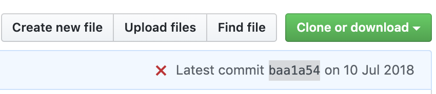
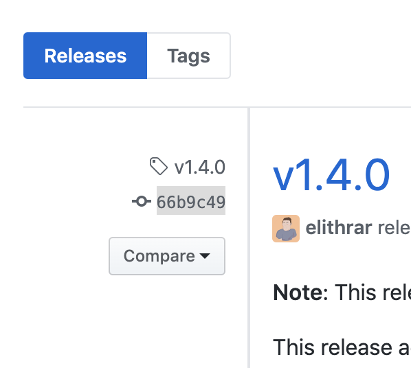

# TheGoRpcLerarnNote
主要学习net/rpc和kite框架 \
[流行的rpc框架性能测试对比](https://blog.csdn.net/quuqu/article/details/79304614) :kite 不是开源的 改学 thrift kit

## 下载方式

    go get github.com/PlagueCat-Miao/TheGoRpcLerarnNote  
    git clone https://github.com/PlagueCat-Miao/TheGoRpcLerarnNote.git
    
    cd $GOPATH/src/github.com/PlagueCat-Miao/TheGoRpcLerarnNote;git pull origin master;git diff  

## 上载方式

git add .   \
git commit -m "XX"   \
git statue   \
git diff   \
git push origin master   \
git add . ; git commit -m "快捷上传"; git push origin master

     cd $GOPATH/src/github.com/PlagueCat-Miao/TheGoRpcLerarnNote;git add . ;git commit -m "快速上传"; git push origin master 


## 用户信息
```
#### 用户名
    PlagueCat-Miao
#### 自动输入密码
    git config  credential.helper store
```
## install 
MaC:
    [Mac install Thrift](https://blog.csdn.net/liuxinmingcode/article/details/45567241)
    
liunx:

    sudo apt-get install automake bison flex g++ git libboost-all-dev libevent-dev libssl-dev libtool make pkg-config
    # 下载安装包
    http://archive.apache.org/dist/thrift/ 
    http://www.apache.org/dyn/closer.cgi?path=/thrift/0.9.1/thrift-0.9.1.tar.gz
    curl -# -O http://archive.apache.org/dist/thrift/0.9.2/thrift-0.9.2.tar.gz
    wget http://archive.apache.org/dist/thrift/0.9.2/thrift-0.9.2.tar.gz 
    # 下载完成后开始解压
    tar zxvf thrift-0.9.2.tar.gz
    # 进入文件夹
    cd thrift-0.9.2
    # 初始化配置
    ./configure
    # 开始构建
    make
    # 一定要用sudo，本机编译
    sudo make install
    # 查看thrift是否生效
    thrift --version
    # 显示：Thrift version 0.9.2

windows:
[Apache Thrift 在Windows下的安装与开发](https://blog.csdn.net/colouroo/article/details/38588297)

## get-start
[Thrift RPC 使用指南实战(附golang&PHP代码)](https://blog.csdn.net/liuxinmingcode/article/details/45696237)
[thrift go语言官方例子](https://www.jianshu.com/p/27f721c13c5d)
git clone https://github.com/apache/thrift.git


## 墓碑
### 架构

### 日志

## 雷区
### 1.因麻烦而写的民工三连
git add . ; git commit -m "快捷上传"; git push origin master

[使用 Go Modules（模块）进行依赖项迁移](https://studygolang.com/articles/23133?fr=sidebar)
开始使用依赖关系管理
若要转换已使用依赖关系管理工具的项目，请运行以下命令:
go: creating new go.mod: module github.com/my/project
go: copying requirements from Godeps/Godeps.json

### 2. go.mod replace
replace 时如何输入版本号
 - 可以输入 分支名  / tag / commit 号:一般他们为网页的最后一个尾缀；go get 的过程中会自动找到正确的版本编号,并更新 go.mod
 - 输入master 如:`https://github.com/koding/kite`
     - 就可以输入 `xxxx => github.com/koding/kite master`
     - go get 后go.mod更新为  `github.com/koding/kite v0.0.0-20180710021347-baa1a54919e3`
 - 完整commit号 如：`https://github.com/koding/kite/commit/59a699eb5ebad76fecf2b375b4599650eaf936f3`
    - 就可以输入 `xxxx => github.com/koding/kite 59a699eb5ebad76fecf2b375b4599650eaf936f3`
    - go get 后go.mod更新为  `github.com/koding/kite v0.0.0-20180710021347-baa1a54919e3`
 - 简码commit 如 
    - 就可以输入 `xxxx => github.com/koding/kite baa1a54`
    - go get 后go.mod更新为 `github.com/koding/kite v0.0.0-20180710021347-baa1a54919e3`
 - branch  如：`https://github.com/koding/kite/tree/fix-etcd-build`
    -  就可以输入 `xxxx => github.com/koding/kite fix-etcd-build`
    -  也可以commit 简码 `xxxx => github.com/koding/kite 59a699e`
    -  go get 后go.mod更新为 `github.com/koding/kite v0.0.0-20150902091132-59a699eb5eba`
 - version 如 `https://github.com/gorilla/websocket/releases/tag/v1.4.0` 
    -  就可以输入 `xxxx => github.com/gorilla/websocket v1.4.0`
    -  也可以是tag 下的 commit 简码  如`xxxx => github.com/gorilla/websocket 66b9c49`
    -  go get 后go.mod更新为 `github.com/gorilla/websocket v1.4.0`
 ### 3. go.mod replace 特例
 1. 某些项目会在项目内以vx文件夹的形式发布高级版本如：`https://github.com/igm/sockjs-go/tree/master/v3`
    -  首先这个 vx文件下下有独立的go.mod
    -  如果要 import `github.com/igm/sockjs-go/v3`
    -  如果要 replace(commit简码) `github.com/igm/sockjs-go v2.0.1+incompatible => github.com/igm/sockjs-go/v3 50a6500` 
 2. `code.google.com/` 失败
    - 其中`p/go.net`路径下 已被转移`golang.org/x/net`
    - 如`code.google.com/p/go.net/websocket`
       - go.mod 不可改为`golang.org/x/net/websocket` 因为没有go.mod
       - go get `golang.org/x/net`
       - ~~import 改为`golang.org/x/net/websocket`~~
 
 ### 4. go.mod 配置
 对于某个项目，如果需要 replace 、require 只需要在此目录下的go.mod 设计。整个go build过程都生效，
  - 当然你也可以去pkg 里去改。
  - 当然你子项目GET不到，不会在主项目里更新require，但在主go.mod里replace生效
  - //是注释 会因为 `go mod tidy` 而被清除 
 ### 5. git clone 是克隆整个仓库
  你会得到所有分支 直接 `git branch` 转分支
   
  